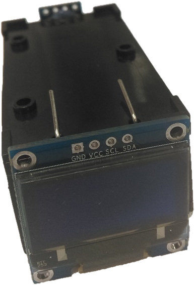
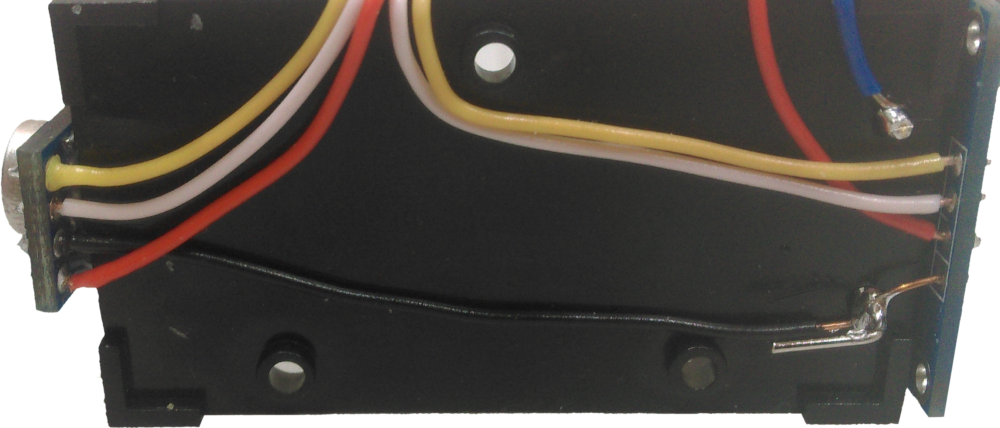
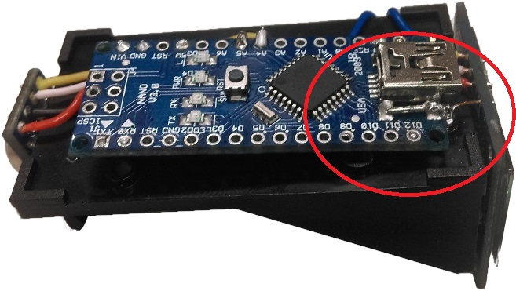
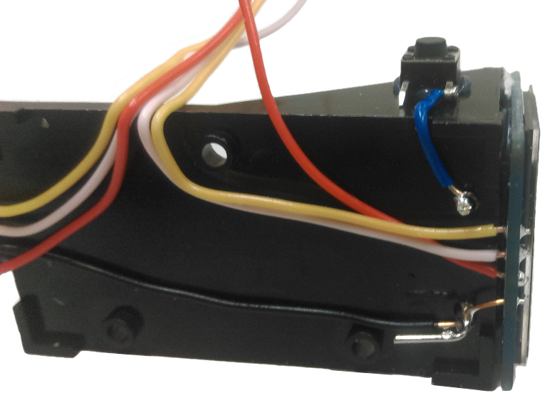
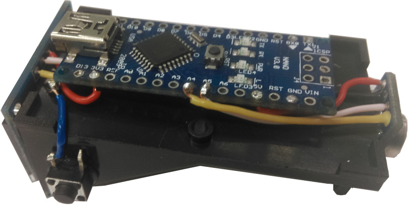
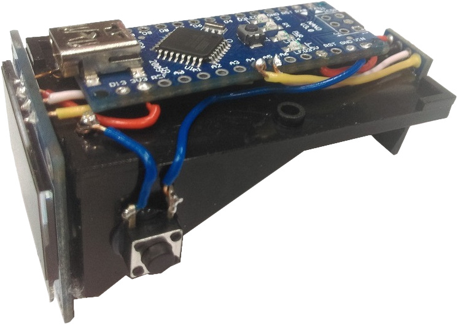

# Handy Thermometer

Keep this handy tool close by when you’re building your next project. Using a simple, non-contact thermometer module, this little button activated device makes it easy to check any heat source and compare with ambient room temperature. Use it to find where a potential short is on your circuit boards or how hot your coffee is before burning your tongue. Push button operated.

## Bill of Materials

|Qty| Code | Description |
|---|---|---|
|1 | [XC4414](http://jaycar.com.au/p/XC4414) | Arduino Nano
|1 | [XC3704](http://jaycar.com.au/p/XC3704) | Temperature sensor
|1 | [PH9235](http://jaycar.com.au/p/PH9235) | 9V PCB Battery holder
|1 | [SB2423](http://jaycar.com.au/p/SB2423) | 9V Battery
|1 | [SP0601](http://jaycar.com.au/p/SP0601) | Tactile pushbutton switch
|1 | [WH3032](http://jaycar.com.au/p/WH3032) | Solid core leads
|1 | [XC4384](http://jaycar.com.au/p/XC4384) | Monochrome OLED screen

## Connection table

As both of these devices are I2C, they are connected to the same signal lines

| NANO | OLED screen | Temp module |
| --- | --- | --- |
| 3v3 | VCC | VIN |
| G   | GND | GND |
| A4  | SDA | SDA |
| A5  | SCL | SCL |

This is a very simple circuit, the only final piece is the switch, that bridges the connection between the 9V battery and the VIN pin. If you wanted to use a switch instead, you can then keep the device turned on, and have the pushbutton cause a data-hold instead, by feeding the button into one of the digital input pins.

## Software Libraries

Thankfully both of these libraries can be found in the Arduino library manager.

| Software | Author | Version |
| --- | --- | --- |
| Adafruit_SSD1306  | Adafruit | 1.2.9 |
| Adafruit_MLX90614 | Adafruit | 1.0.0 |

## Know how

* [Removing Header pins](https://jaycar.com.au/removingHeaders)

## Assembly

The very first step to do is to remove all the pins from the OLED, Temperature sensor, and arduino Nano.

Hot glue both the OLED and temperature sensor to both sides of the battery holder, so that the pin holes line up along the top (underside) of the battery holder, as shown:

Next, solder some solid core wires to each module, using the same colour scheme on both so that you don't get confused. We've used Red for VCC, Black for Ground, Yellow for SDA, and White for SCL.

We also attach a blue wire from the positive leg and trim it down. This is to go through the button and into the VIN pin on the nano.

The ground for the temperature sensor can come up and attach to the negative terminal, which is on the right side of the picture above. You can also bridge the connection from the OLED ground pin to the terminal, making sure to keep the pin upright as we will soon bend it into position for the nano.

It is easiest if you place the nano up against the pin, and find where the bending point should be, before bending it with a proper pair of sturdy pliers. The pin is made out of thick metal which can make it a little firm to bend. The idea here is to bend it such that it can run alongside the USB connector, as shown in the below picture, which was taken after construction.

To attach the button, first hot glue it to the side of the battery holder, ensuring that it is facing upright, such as in the below photos.

Wait for the glue to set before soldering, as the heat can potentially disrupt the glue. We want to do a quick 2 second solder job here.

###### Connections

Now all that is left is to do the connections to the board according to the connection table above.
If you are using the same colourscheme as us, you should have Yellow going to pin `A4` on the nano, and White to pin `A5`.

The OLED VCC can neatly connect up to the 3v3 pin, and the Temperature sensor can go on the 5V, either with the ISCP or the pin connection on the side.

Trim and strip the leads so they can neatly fit the required length, and poke up from the bottom of the nano so the wires are neatly hidden underneath. Because we have both of the modules connecting to the same pins, we have connected the thermometer wires on the top.

Around this time is when you can put another blue lead from the VIN pin to the pushbutton switch.

## Testing

* The most common issue with I2C is getting the wires mixed up the wrong way, so make sure that SDA is connected to pin A4, and SCL is A5.

* Next, check the connections for any shorts where there shouldn't be, and open-circuits where it should be connected.

* Check with power going to the device, if there's nothing displaying on the screen, use the Adafruit_SSD1306 example code to test the screen or see a serial output.

* If the device does not power on with the battery, make sure that the switch is going the right way and that there is 9V on the VIN pin when the button is pressed.

## Programming

Programming is a simple case of opening in Arduino IDE, installing the libraries, and pressing upload.

You could also enable some app on your computer to datalog for the HandyThermometer if you uncomment the last two lines of code, which will output the data to the `Serial` port and be picked up by whatever computer software you would like. Look at the software specifications for what the data format is.
